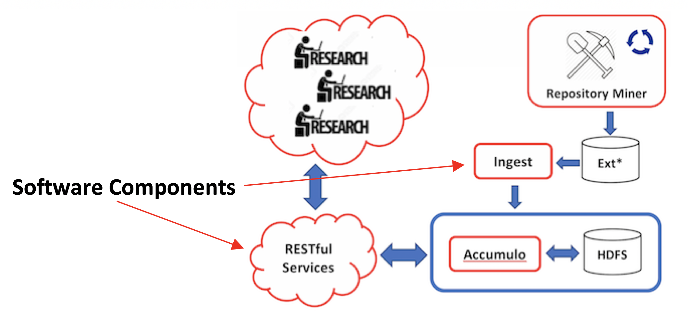

# The principal components of this body of software:

1. Ingest
2. RESTful Services

## Ingest
The ingestion component of the code is responsible for the following:
 1. Reads zipped tar files that are parsed for apiKey-value pairs,
 2. Generates a Row identifier based on
    * Corpus version,
    * Project name,
    * Creation date,
    * Repository,
    * UUID,
 3. Inserts each RowID/<Key/Value> pair in a projectMetadata column family,
 4. Inserts a rotating RowId that includes topics and languages in addition to the RowId in (3) forming a partition index. 

## RESTful Services
The RESTful services supply the following endpoints:
* Account creation,
* Category Browsing,
* Searching for projects using boolean expressions,
* Basic statistics on metadata valuse (min, max, counts, and average),
* Reading and writing of exclusive and nonexclusive metadata 

## Source Organization
#### model

accumulo

Wraps calls using accumulo api for scans (reads) and mutations (writes).

entities

Entities folder predominantly contains a hierarchy of return types for JSON producing endpoints:

* Corpus Metadata
* Project Metadata
* User Metadata

#### muse_utils

AccountServices

Code responsible for creating accounts.

App

Main entry point of the app.

Ingest

Ingest is responsible for populating Accumulo tables.

Security

Handles authentication and authorization.

#### resources

Accounts

Code responsible for creating accounts.

CategoryBrowsing

Mostly UI support, Help, query, query validation,.

CategoryItem

Serves category-based projects.

Content

(Untested) Returns content files

Metadata

Serves metadata values, 

ResourceBase

Base class for resource classes.

Stats

Returns basic statistics on metadata keys and values.

Summary

Counts the total number of metadata keys.

UserData

Populates accumulo with data written by accounts.

